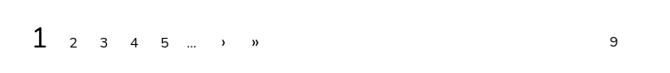
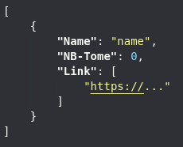

<h1 align="center">
    Workshop - WebScraping Crawl
</h1>

<p align="center">
    
</p>
<br>

<h3 align="center">
    The objective of this workshop is to discover how to make a crawl on WebScraping
</h3>
<br><br>

# **Before**

Before this workshop we organise two other ones, if you wasn't here to the first one, we suggest you to see all the notion that we saw.
> https://github.com/nathan-hoche/Workshop_ScrapingWeb_Python

<br>

# **What's a Crawl**

A Crawl is the action of browsing a website using webscraping.

<br><br>

# **Objectif of this workshop**
In this workshop, we are going to crawl the pika website, to know how many manga they purpose by series, and get all links to see informations on each ones.
<br><br>

# **Get started**

The starting page of our crawl will be: 
```
https://www.pika.fr/serie
```

## **Exo1 - Get page content**
We need to get page content, let's try to get this with request library:
```python
import requests
```

## **Exo2 - Get Serie**
In this part, we are going to select all series link using the previous webpage in page's content.<br>
You need to use 'BeautifulSoup' parser to automatically parse to utf-8, and easly do a small html parsing.<br>
For specific parsing you can use XPath or regex.

Stock all the links inside a tab, we are going to use them later. 

> You can use the website "https://regex101.com/" to get more information on regex and a real time using.

<br>

## **Exo3 - Get Other Page**
Currently we only get the first page of series, so try to get the other ones.
<br>

```
/!\ -> When we do a crawl, it's important to limit the process for each test. Like each launch send a lot and a lot of request to a website, that can look like a DDOS attack.

So comment the exercice 2, and reproduce + adapt the exercice 2 for doing the exercice 3.
```

Look on this part of the page:



For this exercice you have some task:<br>
1) Get the url from the other website 
2) Request the other page /!\ once each
3) Display a counter to know one which page the program worked

> Stop the program after 10s, a crawl keep running for a log time

<br>

## **Exo4 - Part linking**
Now we have two part:<br>
1) To get All page
2) To get Link on a page

Link them, to have the final result.

<br>

## **Exo5 - Save information you get**
We are going to save, in a real project as crawl can get a giant quantity of information, so it's most common to use a database! <br>

For this workshop, we are only use a json as memory. <br> Let's make it, like the following image:




<br>

# **To go further**
Now that you know how to make a simple scrap, you can try this possibility:
- create a program that crawl a big website to find all product from our list
- crawl a youtube channel to get all different stats from each video

